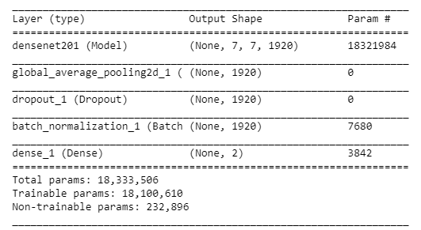
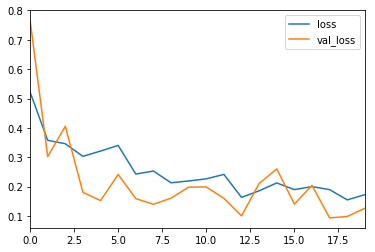
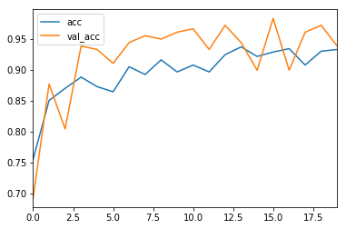
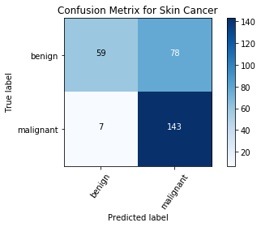
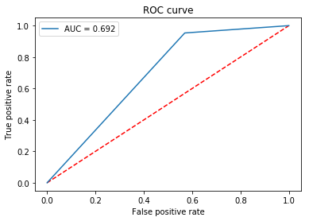
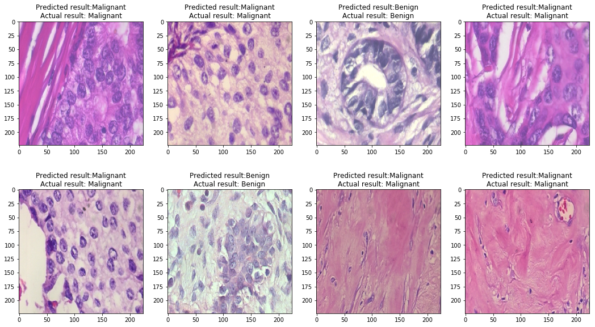
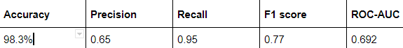

# Breast Cancer Classification

A deep learning project for classifying breast cancer histopathological images into **benign** and **malignant** categories using Convolutional Neural Networks (CNN) and transfer learning.

---

## Overview

This project builds a binary image classification model to distinguish between benign and malignant tissue samples. It uses CNN architectures along with transfer learning to improve performance on medical image data.

---

## Dataset

The dataset used is the **BreakHis (Breast Cancer Histopathological Database)**.

Download:
https://web.inf.ufpr.br/vri/databases/breast-cancer-histopathological-database-breakhis/

### Data Structure

```
dataset/
│── train/
│   ├── benign/
│   └── malignant/
│
│── validation/
│   ├── benign/
│   └── malignant/
```

---

## Tech Stack

* Python
* NumPy, Pandas
* Scikit-learn
* Matplotlib
* Keras / TensorFlow
* Jupyter Notebook

---

## Installation

```bash
pip install numpy pandas scikit-image matplotlib scikit-learn keras
jupyter notebook
```

---

## Model



* Convolutional Neural Network (CNN)
* Transfer Learning approach
* Image preprocessing and augmentation applied

---

## Results

### Loss and Accuracy




### Confusion Matrix



### ROC-AUC Curve



### Predictions




### Performance Metrics

* Validation Accuracy: **98.3%**
* Precision: **0.65**
* Recall: **0.95**
* F1 Score: **0.77**
* ROC-AUC Score: **0.69**

---

## Project Structure

```
Breast-cancer-classification/
│── dataset/
│── images/
│── notebooks / scripts
│── README.md
```

---

## Future Improvements

* Improve precision and ROC-AUC score
* Experiment with advanced architectures (ResNet, EfficientNet)
* Hyperparameter tuning
* Deploy using a web interface

---

## Contact

- LinkedIn: https://www.linkedin.com/in/aditxya/

---

If you found this project useful, consider giving it a ⭐
